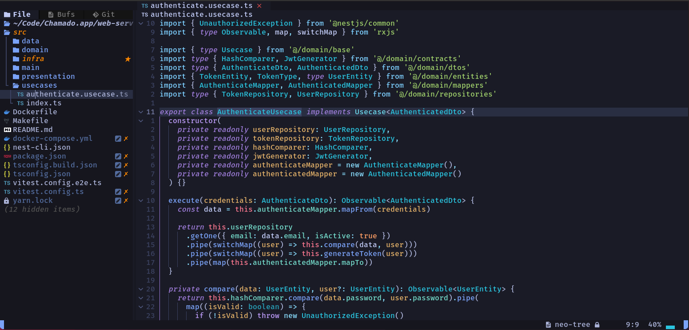

# AstroNvim Config

This is my personal AstroNvim config 🫣  
Suggestions for improvements will be appreciated. Make florks at will...

##### Preview



## Important informations

### Requirements

It's the same requirements as [AstroNvim](https://astronvim.com/#-requirements).

- [lazydocker](https://github.com/jesseduffield/lazydocker) docker ui toggle terminal (`leader + td`) (optional)

---

### Auto completation with AI

This config uses Codeium to autocomplete your code. You will need a Codeium account and api key to do this.

For more information about that see the [Exafunction/codeium.vim](https://github.com/Exafunction/codeium.vim) plugin documentation.

To disable the feature comment out or remove this line in the `plugins/community.lua` file:

```lua
-- Comment out our remove this line
-- { import = "astrocommunity.completion.codeium-vim" },
```

## Installing AstroNvim

##### Make a backup of your current nvim folder

```bash
mv ~/.config/nvim ~/.config/nvim.bak
```

##### Clean neovim folders (Optional but recommended)

```bash
mv ~/.local/share/nvim ~/.local/share/nvim.bak
mv ~/.local/state/nvim ~/.local/state/nvim.bak
mv ~/.cache/nvim ~/.cache/nvim.bak
```

##### Clone AstroNvim

```bash
git clone --depth 1 https://github.com/AstroNvim/AstroNvim ~/.config/nvim
```

## Load my config

##### Clone config

```bash
git clone --depth 1 https://github.com/gabrielscaranello/astronvim-config ~/.config/nvim/lua/user
```

##### Remove the `.git` folder (optional)

```bash
rm -rf ~/.config/nvim/lua/user/.git
```

##### Start Neovim

```bash
nvim
```

## Mappings

This configuration has all AstroNvim mappings, you can check them out [here](https://astronvim.com/Basic%20Usage/mappings).

| Action                | Mappings      |
| --------------------- | ------------- |
| Save file             | `C-s`         |
| ToggleTerm lazydocker | `leader + td` |

## Links

- [AstroNvim](https://astronvim.com/)
- [My dotfiles](https://github.com/gabrielscaranello/dotfiles)
- [My Arch install guide](https://github.com/gabrielscaranello/arch)
